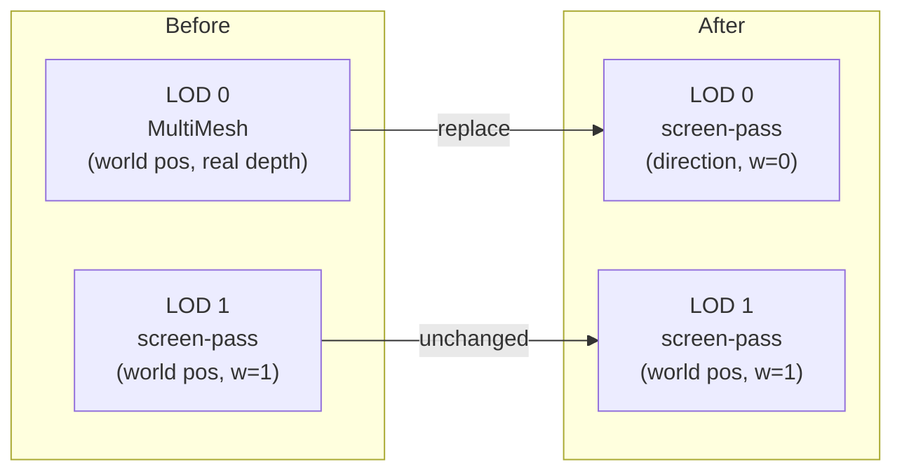

# Sky Dome LOD 0 Refactor

## Why the pop-in persists

Even with the depth fix, the LOD 0 → LOD 1 crossfade is a handoff between two visually different renderers:
- LOD 0: `star_point.gdshader` — tiny additive dot, no glow halo
- LOD 1: `star_screen_pass.gdshader` — soft glow disc, blend_mix

The alpha crossfade is there but the character of the two renders doesn't match, so a visual seam remains at the 80 000-unit boundary. The sky dome approach fixes this by eliminating LOD 0 as a separate renderer — both LOD 0 and LOD 1 draw through the same screen-pass fragment shader. Only the data format differs.

## Core idea



For LOD 0, passing the direction as `vec4(dir, 0.0)` to `VIEW_MATRIX` strips the translation component automatically — only camera rotation contributes, exactly like a skybox. No world-position geometry, no depth buffer involvement, no AABB.

## Files changed

### 1. [`core/stars/StarRecord.gd`](core/stars/StarRecord.gd)
Add one precomputed field:
```gdscript
var sky_direction: Vector3  # normalized(position); set once at generation, immutable
```
Set it in `StarRegistry._generate_catalog()` after assigning `record.position`:
```gdscript
record.sky_direction = record.position.normalized()
```

### 2. [`core/stars/StarRegistry.gd`](core/stars/StarRegistry.gd)

**Remove entirely:**
- `_multimesh_instance`, `_multimesh` members
- `_HIDDEN_TRANSFORM` constant
- `_lod_dirty` dirty-flag array and all references
- `_setup_multimesh()` function
- `_update_multimesh()` function

**`_update_lod()` change:** LOD 0 stars are now added to `_screen_pass_stars` alongside LOD 1 stars. The existing crossfade weights already express the correct blend direction for both LOD 0→1 and LOD 1→0 transitions — no logic change needed there.

**`_update_shader_uniforms()` change:** split the star list before uploading:
- LOD 0 stars → packed into `sky_dir[i] = vec4(sky_direction, 0.0)` and a matching color/weight array
- LOD 1/2 stars → existing `star_pos_radius` / `star_color` arrays (unchanged)

Add a **cone frustum cull** for the sky stars before the upload: `dot(star.sky_direction, cam_forward) > fov_threshold` keeps only stars within the camera cone, keeping the sky-star count well under the shader cap.

**New shader parameters to set each frame:**
```gdscript
_screen_pass_material.set_shader_parameter("sky_star_count",  n_sky)
_screen_pass_material.set_shader_parameter("sky_star_dir",    _u_sky_dir)
_screen_pass_material.set_shader_parameter("sky_star_color",  _u_sky_color)
```

### 3. [`core/stars/star_screen_pass.gdshader`](core/stars/star_screen_pass.gdshader)

Add a second uniform block for sky stars (LOD 0):
```glsl
const int MAX_SKY_STARS = 512;
uniform int  sky_star_count = 0;
uniform vec4 sky_star_dir[MAX_SKY_STARS];   // xyz = unit direction, w unused
uniform vec4 sky_star_color[MAX_SKY_STARS]; // rgb = color, a = crossfade weight
```

Add a second loop in `fragment()` after the existing LOD 1 loop:
```glsl
for (int i = 0; i < sky_star_count; i++) {
    vec3 dir = sky_star_dir[i].xyz;

    // w=0 strips camera translation — only rotation affects this star's position.
    vec4 view_pos = VIEW_MATRIX * vec4(dir, 0.0);
    if (view_pos.z >= -0.001) continue;

    vec4 clip = PROJECTION_MATRIX * view_pos;
    if (clip.w <= 0.0) continue;
    vec3 ndc = clip.xyz / clip.w;
    if (abs(ndc.x) > 1.5 || abs(ndc.y) > 1.5) continue;

    vec2 star_px = vec2(
        (ndc.x * 0.5 + 0.5) * viewport_px.x,
        (ndc.y * 0.5 + 0.5) * viewport_px.y
    );

    // Sky stars render at min_pixel_radius only — they have no world-space
    // radius because distance is undefined (they live on the dome).
    float d = distance(frag_px, star_px);
    float t = d / min_pixel_radius;
    if (t > 1.0) continue;

    float glow = 1.0 - smoothstep(0.0, 1.0, t);
    float weighted_glow = mix(0.0, glow * intensity, sky_star_color[i].a);
    rgb   += sky_star_color[i].rgb * weighted_glow;
    alpha  = max(alpha, weighted_glow);
}
```

### 4. [`core/stars/star_point.gdshader`](core/stars/star_point.gdshader)
Delete this file — it is no longer used.

## What stays the same
- All LOD crossfade logic (`blend_alpha`, `lod_prev_state`, `_compute_screen_pass_weight`) — unchanged
- LOD 1 and LOD 2 rendering — unchanged
- The `extra_cull_margin` addition on `_multimesh_instance` becomes moot (node removed), but the screen-pass quad already has it

## Star count budget

| Situation | Expected LOD 0 stars in 90° cone |
|---|---|
| Galaxy core, looking out | ~400 |
| Galaxy edge, looking in | ~200 |
| MAX_SKY_STARS cap | 512 |

CPU-side cone cull (`dot(sky_dir, cam_forward) > threshold`) runs before the upload and keeps the uploaded count comfortably under 512.
